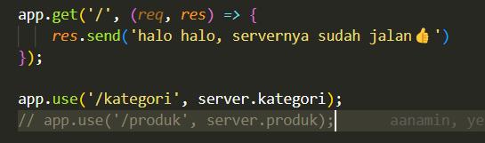
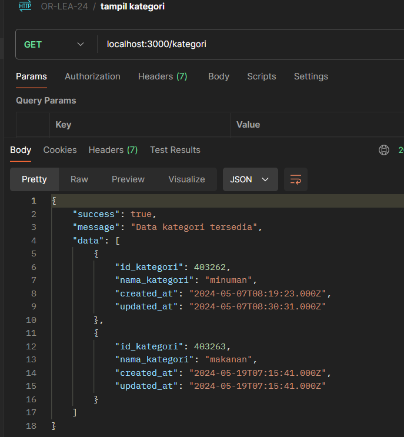
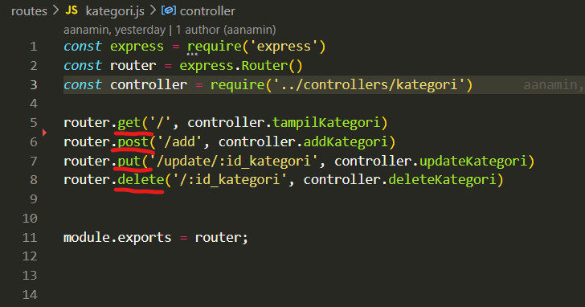
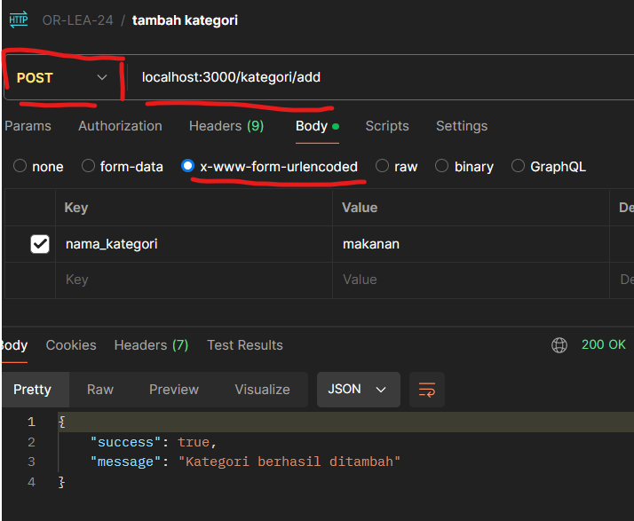
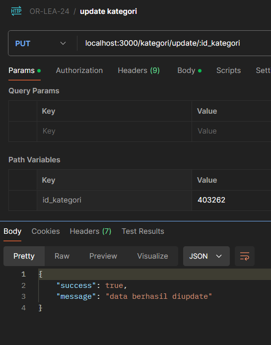
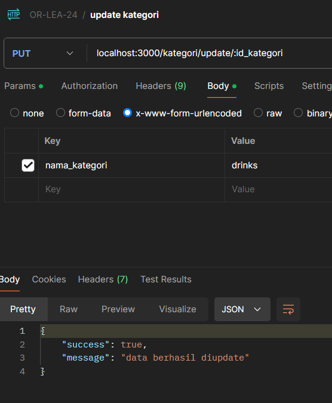

# upgrading or lea - CRUD

1. clone repo ini di pc/laptop teman-teman, jalankan di terminal `git clone https://github.com/aanamin/CRUD.git`
2. install dependensi aplikasinya, jalankan di terminal `npm install`
3. tambahkan database nya dengan mengimport file sql yang ada di repo ini `lea-or14-crud.sql` di phpmyadmin yang sudah terinstall sebelumnya, sesuaikan juga nama database dengan yang ada di file `.env`, tepatnya pada bagian `DB_NAME`
4. jalankan aplikasi dengan perintah `npm start` pada terminal
5. akses dengan app postman, dengan url `localhost:3000`
6. akses sesuai dengan url route, misal untuk menampilkan kategori, masukkan url `localhost:3000/kategori` dengan method get

7. begitu juga dengan tambah kategori, jangan lupa sesuaikan method nya pada postman. pada tambah kategori, kita menggunakan method post, 

isikan juga data pada bagian body, pilih yang 'x-www-form-urlencoded'

8. begitu juga dengan yang lainnya, contahnya edit, masukkan parameternya, yaitu id kategori

masukkan juga data yang ingin dikirmkan pada body

9. silahkan dicoba yang lainnya

